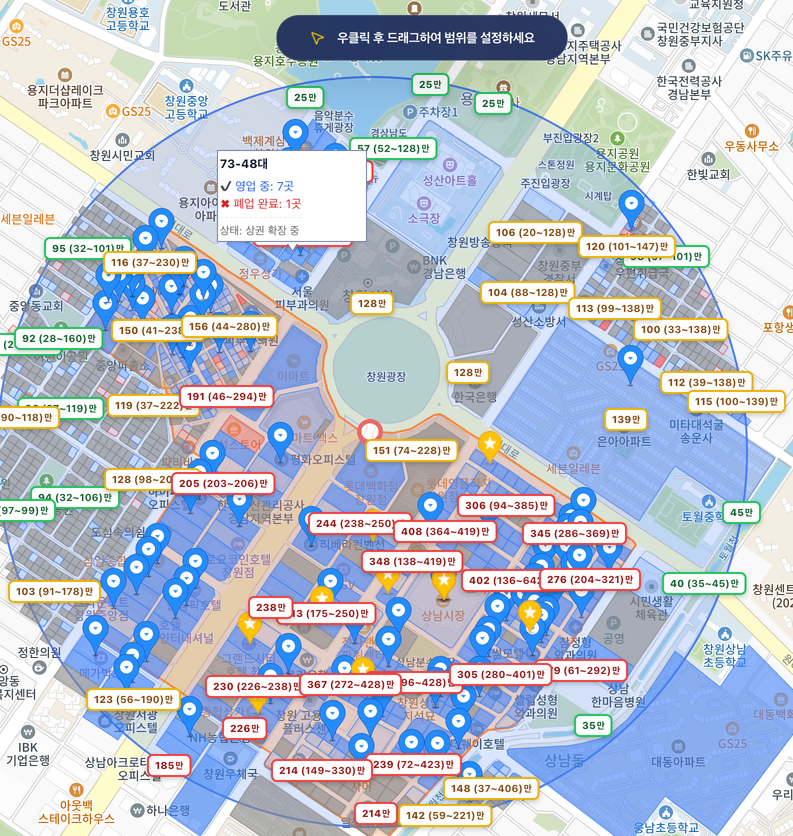
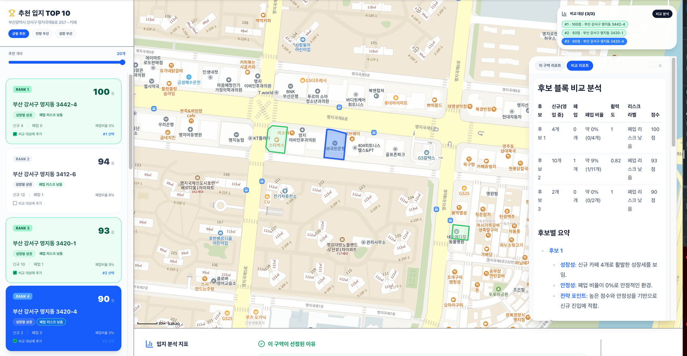

# SBC 365

소상공인·예비 창업자를 위한 상권 분석 및 창업 지원 웹 서비스입니다. 지도에서 위치·반경·업종을 고르면 여러 공공데이터를 한 번에 모아 상권을 분석하고, 조건에 맞는 정부 지원사업을 찾아 공고문을 요약해주며, **한글(HWP·HWPX) 신청서 양식의 빈칸을 대화를 통해 채워줍니다.**

2026년 국립창원대학교 컴퓨터공학과 졸업과제. (2인 팀)

---

## 왜 만들었나

창업 입지를 정하려면 상권 통계, 부동산 시세, 인구 구조, 경쟁 점포, 지원사업 공고를 동시에 봐야 합니다. 데이터는 이미 공개돼 있지만 기관마다 API와 문서 형식이 달라서, 흩어진 것을 모아 해석하는 일은 사용자 몫으로 남습니다.

특히 **지원사업의 실제 조건과 신청서는 HWP·PDF 첨부파일 안에 있습니다.** 목록만 봐서는 신청 가능한지 알 수 없고, 신청서는 한글 파일을 직접 열어 채워야 합니다.

---

## 기능

### 1. 상권 분석

지도에서 **우클릭으로 중심점을 찍고 드래그로 반경을 정하면**(Kakao Polyline으로 거리를 실시간 계산, API 안정성을 고려해 최대 750m), 좌표에서 행정동 코드를 자동으로 얻어 여러 공공 API를 병렬 호출합니다. 사용자가 행정동 코드를 몰라도 됩니다.

수집·시각화하는 항목:

| 항목 | 출처 | 쓰임 |
| --- | --- | --- |
| 주변 점포 | 상가 DB | 방위·거리별 분포로 집계 |
| 개별공시지가 | VWorld WFS | 중심부 vs 주변부 비교, 저가·중가·고가 밴드. 매매가를 공시지가의 1.5~2배로 추정 |
| 상업용 실거래 | 국토부 RTMS | 최근 12개월 거래를 반경으로 필터링해 실제 가격대 파악 |
| 행정동 인구 | SGIS | 가중 평균 연령 등 타깃 적합성 |
| 주요 상권 폴리곤 | ODCloud | 분석 위치가 핵심 상권에 속하는지 |
| 신규·폐업 인허가 | 행정안전부 | 블록 단위 활력도 |

**블록 활력도**는 인허가 데이터를 블록별로 집계해 계산합니다.

```
vitality      = activeCount - closedCount
closureRatio  = closedCount / (activeCount + closedCount)
```

이 값으로 블록을 성장형 / 보합 / 위축으로 분류해 지도에 색으로 표시합니다. 단순 점포 수가 아니라 **상권이 커지는 중인지 줄어드는 중인지**를 보여주는 것이 목적입니다.

집계가 끝나면 GPT-4o가 마크다운 형식의 상권 리포트를 생성합니다.



반경 안의 점포와 추정 가격대가 지도에 표시되고, 블록을 누르면 영업·폐업 현황과 상권 상태가 나옵니다.

### 2. 자연어 업종 검색

업종 소분류가 **247개**라 드롭다운에서 고르게 하면 사용자가 자기 업종을 못 찾습니다. `"삼겹살"`처럼 평소 쓰는 말을 입력하면 계층 구조로 매핑합니다.

```json
{ "large": "음식", "mid": "한식", "small": "돼지고기 구이/찜" }
```

3단계 클릭이 검색 한 번으로 줄었습니다.

### 3. 지원사업 조회 · 공고 요약

지역·대상 조건으로 지원사업을 조회하고, 첨부 공고문(HWP / HWPX / PDF)을 서버에서 텍스트로 변환해 **지원대상 · 지원내용 · 지원규모 · 신청기간 · 필수요건 · 유의사항**으로 요약합니다.

```
Node.js  기업마당 공고 페이지에서 Cheerio로 첨부 링크 수집
   ↓
Python   HWPX → ZIP + XML 파싱 / HWP → hwp5txt / PDF → PyMuPDF
   ↓
GPT-4o   항목별 요약
```

### 4. 신청서 자동 작성

한글 신청서 양식의 빈칸을 대화로 채웁니다.

**첨부파일 고르기부터 문제였습니다.** 한 공고에 공고문·안내문·신청서가 섞여 있어서 잘못된 파일을 열기 쉽습니다. 그래서 첨부 후보를 **신청서식 관련 키워드로 점수화하고 공고문·안내문은 감점**해 자동으로 고르되, 후보가 여러 개면 사용자가 선택하도록 했습니다.

파일이 정해지면:

```
① 문서를 열어 표 구조 추출
② 표를 행·열 좌표를 가진 격자로 정규화
③ 격자를 LLM에 전달해 "채워야 할 칸" 후보 목록 생성
④ 사용자와의 대화로 각 칸의 값 결정 (건너뛰기 가능)
⑤ 결정된 셀만 원본에 반영해 다시 패키징
```

②에서 만드는 격자는 라벨과 위치를 함께 담습니다.

```
cell_2 = '업체명',            ((1), (0,1))
cell_3 = '',                  ((1), (2,3))
cell_4 = '대표자',            ((1), (4))
cell_6 = '사업자등록번호',     ((2), (0,1))
```

원본 서식을 그대로 두고 **정해진 셀만 바꿔 다시 포장**하므로, 문서를 새로 만들지 않고 기존 양식을 유지합니다.


항목을 하나씩 물어보고, 모르는 항목은 건너뛸 수 있습니다. 아래 칩에서 지금까지 채워진 값과 건너뛴 항목을 한눈에 봅니다.

### 5. 입지 추천

분석한 블록들을 점수로 정렬해 후보를 뽑습니다. 전략에 따라 가중치가 다릅니다.

| 전략 | 활력도 | 밀집도 | 폐업 비율 페널티 |
| --- | --- | --- | --- |
| 균형 추천 | 반영 | 반영 | 미반영 |
| 안정 우선 | 축소 | 축소 | **강함 (−80배)** |
| 성장 우선 | 반영 | ×0.4 | 약함 (−30배) |

같은 데이터라도 안정을 원하면 폐업이 잦은 블록이 크게 깎이고, 성장을 원하면 밀집도가 더 반영됩니다. 상위 3개 블록을 골라 인구·가격대·폐업률을 비교하는 AI 리포트를 생성합니다.



---

## 설계에서 신경 쓴 부분

### LLM에 무엇을 넘길 것인가

LLM에 위치와 업종만 던지고 "이 동네 상권을 분석해줘"라고 하면 그럴듯하지만 근거 없는 답이 나옵니다. 수치와 위치를 다루는 순간 실제로 없는 상권이나 지어낸 통계가 섞입니다.

그래서 **원본 데이터를 그대로 넣지 않고, 프론트엔드에서 먼저 집계한 값만 프롬프트에 담도록** 했습니다. 방위별 점포 수, 평균 거리, 지가 밴드, 블록별 신규·폐업 합계처럼 **이미 계산이 끝난 수치만** 넘기고, 시스템 프롬프트로 **"제공된 수치 외에는 추측하지 말 것"** 을 강제합니다.

부수 효과로 토큰이 줄어 리포트 생성이 LLM 호출 1회로 끝납니다.

### 매번 외부 API를 부르지 않기

신규·폐업 조회에 쓰는 행정안전부 인허가 API는 **업종별로 나뉘어 193개**입니다. 사용자 요청마다 이걸 호출하면 응답이 느리고 외부 장애에 그대로 영향을 받습니다.

**매일 00:05에 스케줄러가 193개를 전부 호출해 MySQL에 반영**하고, 사용자 요청 시에는 DB만 조회합니다. 실시간 호출 대신 미리 받아두는 방식으로 바꾼 것입니다.

### 신청서의 "어느 칸에 무엇을 넣을 것인가"

신청서 자동 작성에서 진짜 어려운 부분은 문서를 여는 것이 아니라 **"이름:"이라는 라벨을 보고 그 값을 어느 칸에 써야 하는지 판단하는 것**이었습니다. 양식마다 표 구조가 달라 라벨이 왼쪽에 있기도 위에 있기도 하고, 셀이 병합돼 있기도 합니다.

규칙으로 처리하면 양식이 바뀔 때마다 깨집니다. 그래서 **문서 전체를 좌표가 있는 하나의 격자로 정규화한 뒤, 그 격자를 통째로 LLM에 보여주고 판단을 맡기는** 방식으로 바꿨습니다. 결과를 셀 단위로 되받아 반영합니다.

---

## API

### 상권·분석

| 메서드 | 경로 | 설명 |
| --- | --- | --- |
| GET | `/api/market/search` | 반경 내 상가 검색 |
| GET | `/api/market/major-districts` | 주요 상권 폴리곤 |
| GET | `/api/market/recommend` | 블록 점수 기반 입지 추천 |
| GET | `/api/real-estate/land-price` | 개별공시지가 (WFS 페이징) |
| GET | `/api/real-estate/trade` | 상업용 부동산 실거래 |
| GET | `/api/analysis/population` | 행정동 인구 |
| GET | `/api/analysis/closed-blocks` | 블록 단위 신규·폐업 집계 |
| GET | `/api/analysis/closure-data` | 폐업 원본 데이터 |
| POST | `/api/analysis/report` | AI 상권 리포트 생성 |
| POST | `/api/analysis/block-report` | 특정 블록 리포트 |
| POST | `/api/analysis/compare-blocks` | 후보 블록 비교 리포트 |

### 업종 분류

| 메서드 | 경로 | 설명 |
| --- | --- | --- |
| GET | `/api/categories/large` | 대분류 |
| GET | `/api/categories/mid/:largeName` | 중분류 |
| GET | `/api/categories/small/:midName` | 소분류 |
| GET | `/api/categories/search` | 자연어 → 업종 매핑 |

### 지원사업

| 메서드 | 경로 | 설명 |
| --- | --- | --- |
| GET | `/api/get-support` | 지원사업 목록 |
| POST | `/api/support/summarize` | 첨부 공고문 AI 요약 |

### 신청서 작성 세션

| 메서드 | 경로 | 설명 |
| --- | --- | --- |
| GET | `/api/applications/check-attachments` | 첨부 후보 확인·점수화 |
| POST | `/api/applications/start` | 세션 시작 (양식 분석) |
| POST | `/api/applications/:id/choose-attachment` | 신청서 파일 선택 |
| GET | `/api/applications/:id` | 세션 상태 조회 |
| POST | `/api/applications/:id/chat` | 대화로 값 수집 |
| POST | `/api/applications/:id/field` | 특정 항목 값 설정 |
| POST | `/api/applications/:id/field/skip` | 항목 건너뛰기 |
| POST | `/api/applications/:id/recommend-field` | 항목 값 추천 |
| GET | `/api/applications/:id/preview` | 작성 상태 미리보기 |
| GET | `/api/applications/:id/preview/file` | 미리보기 파일 |
| POST | `/api/applications/:id/finalize` | 최종 문서 생성 |
| POST | `/api/applications/:id/close` | 세션 종료 |

---

## 측정 결과

2026년 5월 시연 기간에 부산 일대, 반경 500m, 커피 소분류 기준으로 동일 시나리오를 5회 반복 측정한 평균입니다.

| 기능 | 평균 |
| --- | --- |
| 상권 분석 (다중 API 병렬, 레이어 표시까지) | 7.1초 |
| AI 상권 리포트 생성 | 10.1초 |
| 공고문 요약 (다운로드 + 추출 + LLM) | 9.4초 |
| 추천 페이지 랭킹 표시 | 0.3초 |

문서 텍스트 추출 성공률 (시연 샘플 15건) — HWPX 6/6, PDF 5/5, HWP 3/4

---

## 기술 스택

**프론트엔드** React 19 · TypeScript · Vite · Tailwind CSS · Zustand · Kakao Maps SDK

**백엔드** Node.js · Express 5 · MySQL · OpenAI API (GPT-4o / GPT-4o-mini) · Cheerio

**문서 처리** Python — HWPX(ZIP + XML) · HWP(hwp5txt) · PDF(PyMuPDF)

**외부 데이터** 국토교통부 RTMS · VWorld · SGIS · 행정안전부 인허가 · ODCloud · 기업마당(Bizinfo)

**배포** Docker 이미지로 빌드해 AWS EC2에서 구동

---

## 구조

```
backend/
  controllers/       API 컨트롤러 (신청서 세션 라우터 포함)
  services/          공고 크롤러, 필드 분류·추출, 문서 캐시·미리보기, HWP 브리지, S3
  db/                스키마 마이그레이션
  hwpx_analysis/     HWPX 표 구조 분석 · 셀 반영 · 재패키징
  hwp_analysis/      HWP 표 구조 분석 · 셀 반영 · 재패키징
  scripts/           파이프라인 회귀 테스트
frontend/
  src/pages/         분석 페이지, 추천 페이지
  src/components/    대시보드, 사이드바, 지도 컨트롤, 신청서 대화 패널
  src/store/         Zustand 전역 상태
docs/                배포 가이드
```

분석 페이지에서 계산한 블록 geometry와 활력도를 추천 페이지에서 그대로 이어 쓰기 때문에 페이지를 옮겨도 다시 조회하지 않습니다. 이 연결을 Zustand 전역 상태로 처리했습니다.

---

## 한계

- 외부 공공 API의 호출 한도와 응답 지연에 영향을 받습니다. 공시지가·블록 활력도는 반경 내 필지 수에 따라 3.5초에서 10초까지 변동합니다.
- 데이터가 희소한 구역에서는 AI 리포트가 일반론에 가까워집니다.
- HWP(구형식) 처리는 외부 CLI 도구에 의존합니다.
- **신청서 자동 작성은 채워야 할 칸을 모두 찾아내지 못하거나 위치가 어긋날 수 있습니다.** 제출 전에 한글 뷰어에서 서식과 내용을 반드시 확인해야 합니다.
- 카드 매출 등 유료 상권 데이터는 연동하지 않았고, 전국 모든 행정동에 대한 실시간 커버리지를 보장하지 않습니다.
